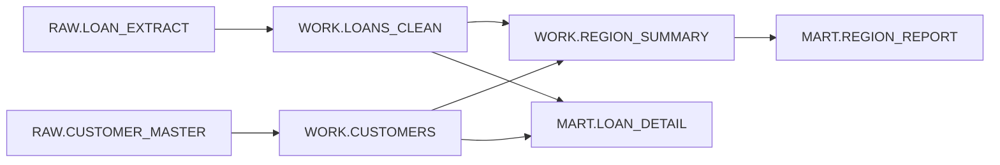

```mermaid
flowchart LR
    t1["RAW.LOAN_EXTRACT"] --> t2["WORK.LOANS_CLEAN"]
    t3["RAW.CUSTOMER_MASTER"] --> t4["WORK.CUSTOMERS"]
    t4["WORK.CUSTOMERS"] --> t5["WORK.REGION_SUMMARY"]
    t2["WORK.LOANS_CLEAN"] --> t5["WORK.REGION_SUMMARY"]
    t2["WORK.LOANS_CLEAN"] --> t6["MART.LOAN_DETAIL"]
    t4["WORK.CUSTOMERS"] --> t6["MART.LOAN_DETAIL"]
    t5["WORK.REGION_SUMMARY"] --> t7["MART.REGION_REPORT"]
```
